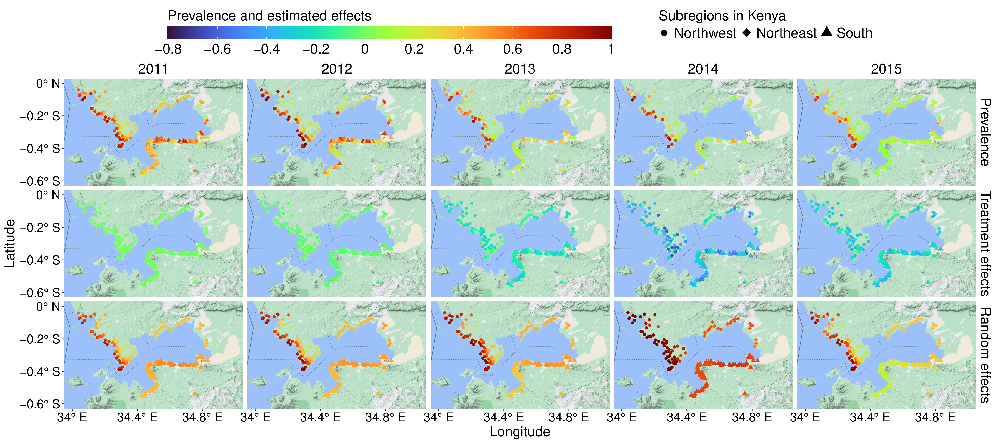
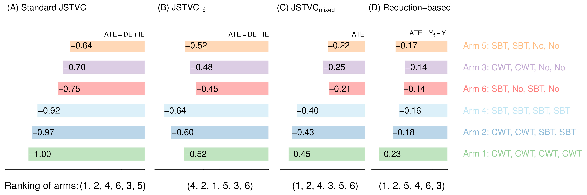
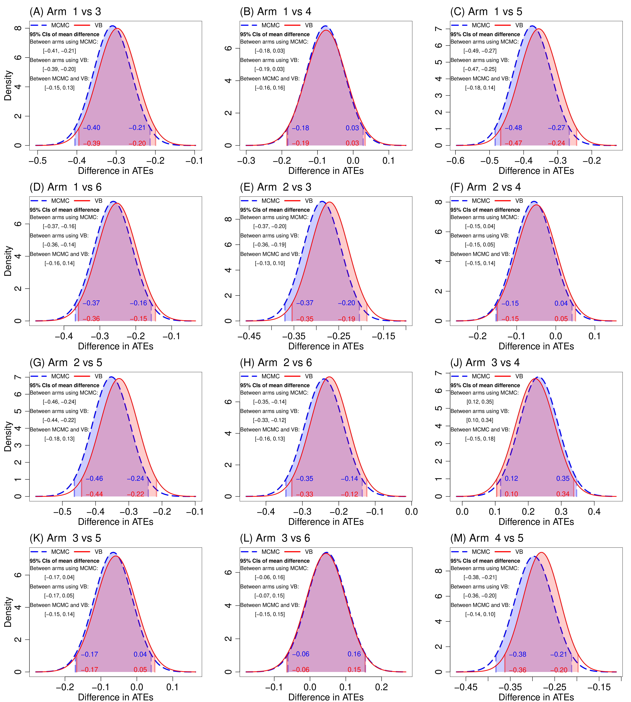

# Identifying Optimal Schistosomiasis Treatment Sequences for Mass Drug Administration Using Direct and Indirect Effects in Spatiotemporal Trials

This Github page provides code and data for reproducing the results in the manuscript:``Identifying Optimal Schistosomiasis Treatment Sequences for Mass Drug Administration Using Direct and Indirect Effects in Spatiotemporal Trials'' by Y. Chen, X. Wen, F. Luo, Y. Yang, and Y. Shen. 

## Datasets of schistosomiasis from the SCORE project
Schistosomiasis, a neglected tropical parasitic disease, is prevalent in Africa, South America, and Asia − especially in rural areas with poor socioeconomic conditions (Hong et al., 2022) − with cases reported in more than 70 countries (World Health Organization, 2022). In 2021 alone, at least 251 million people required preventive treatment (World Health Organization, 2023). Global efforts to control morbidity have primarily focused on preventive chemotherapy using praziquantel (PZQ), typically delivered through Mass Drug Administration (MDA) via School-Based Treatment (SBT) or Community-Wide Treatment (CWT). To systematically evaluate and compare the two treatment strategies, the Schistosomiasis Consortium for Operational Research and Evaluation (SCORE) conducted a five-year cluster randomized trial (CRT) across multiple countries. This data can be saved under the path "./data". Data description is as follows:
- We analyze infection prevalence data for Schistosoma mansoni from 149 villages in Kenya and 149 villages in Tanzania, covering a wide age range from 5 to 77 years.
- These infection data, collected on a yearly scale, were obtained through the SCORE project over a 5-year period
- This project involves a CRT with six intervention arms
- Each arm received one of three treatment options (SBT, CWT, or no treatment) annually from the first to the fourth year

## Our methodology
Motivated by the need to identify optimal treatment regimens in the Schistosomiasis Consortium for Operational Research and Evaluation CRT, this study addresses two major methodological challenges in estimating treatment effects: (1) substantial bias arising  from inadequate accounting for Indirect Effects (IEs) and time-varying Direct Effects (DEs) and (2) large variance from insufficient consideration of intrinsic dependencies. We identify optimal treatment regimens by evaluating differences through two components: DEs from the most recent treatment and IEs from historical treatment trajectories. To efficiently estimate DEs and IEs, we develop a Joint Spatiotemporal Varying Coefficient (JSTVC) model. JSTVC accounts for spatiotemporal dependencies and regional heterogeneities, while also capturing spatial anisotropic patterns associated with schistosomiasis transmission. 

## Scalable algorithms for large-scale randomized experiments with complex spatiotemporal dependence structure
To support scalable inference under complex dependent structures, we develop a scable Variational Bayes algorithm with an ensemble-based correction to improve uncertainty quantification. The proposed methodology provides a broadly applicable framework for modeling complex dependencies in randomized experiments, especially in those involving multiple sequential interventions.


# Code and Data Documentation

To reproduce all results presented in the paper, run `./Main.R`. Depending on the computing environment, the script may take a considerable amount of time to complete.

The following sections summarize the data and code used in the repository.

## A. Data

The `./data` directory contains the following files.

| File | Main objects | Notes |
| --- | --- | --- |
| `Kenya_Score_Data_r.RData` | `Kenya_Score_Data`, `Site`, `Kenya.Dist.c`, `G.mat` | Kenya SCORE trial data, site-level information, and distance/adjacency matrices |
| `Tanzania_Score_Data_r.RData` | `Tanzania_Score_Data`, `Site`, `Tanzania.Dist.c`, `G.mat` | Tanzania SCORE trial data, site-level information, and distance/adjacency matrices |
| `Google_Kenya_Tanzania_Map.RData` | `ken.map`, `tan.map` | Google map objects used for geographic plots |
| `sim.Cov.Data.RData` | `sim.Cov.Data` | Simulation Scenario 1 and 3 covariance object; stored as a list of 5 regional sub-objects |
| `smoothed_surface.RData` | `simData.DataBase` | Simulation Scenario 2 smoothed surface object; stored as a list of 5 regional sub-objects |


### A.1 Using `Tanzania_Score_Data_r.RData` as an illustration

#### Objects in the file

| Object | Class | Description |
| --- | --- | --- | --- |
| `Tanzania_Score_Data` | `data.table`, `data.frame` | Main Tanzania SCORE longitudinal trial data |
| `Site` | `data.frame` |  Village/site summary information for Tanzania |
| `Tanzania.Dist.c` | `matrix`, `array` | Pairwise village distance matrix |
| `G.mat` | `matrix`, `array` | Adjacency matrix generated during preprocessing |

#### Data frames and variables

`Tanzania_Score_Data` (745 x 42)

```{=latex}
\begingroup
\small
\setlength{\tabcolsep}{4pt}
\begin{longtable}{p{0.05\textwidth} p{0.4\textwidth} p{0.6\textwidth}}
\hline
\# & Variables & Description \\
\hline
1 & \texttt{Village\_ID} & Village identifier \\
2 & \texttt{Year} & Observation year \\
3 & \texttt{Prevalence} & Observed infection prevalence \\
4 & \texttt{Study\_Type} & Study or trial type label \\
5 & \texttt{Study\_Arm} & Assigned treatment arm \\
6 & \texttt{Latitude} & Village latitude \\
7 & \texttt{Longitude} & Village longitude \\
8 & \texttt{flag} & Region or geographic grouping label \\
9 & \texttt{CWT\_1} & Indicator for CWT at time lag 1 \\
10 & \texttt{CWT\_2} & Indicator for CWT at time lag 2 \\
11 & \texttt{CWT\_3} & Indicator for CWT at time lag 3 \\
12 & \texttt{CWT\_4} & Indicator for CWT at time lag 4 \\
13 & \texttt{SBT\_1} & Indicator for SBT at time lag 1 \\
14 & \texttt{SBT\_2} & Indicator for SBT at time lag 2 \\
15 & \texttt{SBT\_3} & Indicator for SBT at time lag 3 \\
16 & \texttt{SBT\_4} & Indicator for SBT at time lag 4 \\
17 & \texttt{CWT} & Current CWT indicator \\
18 & \texttt{SBT} & Current SBT indicator \\
19 & \texttt{IEt.CWT} & Pow decay temporal variable for CWT \\
20 & \texttt{IEt.SBT} & Pow decay temporal variable for SBT \\
21 & \texttt{IEt.CWT.exp} & Exponential-decay temporal variable for CWT \\
22 & \texttt{IEt.SBT.exp} & Exponential-decay temporal variable for SBT \\
23 & \texttt{sCWT\_1} & Smoothed or scaled CWT summary at lag 1 \\
24 & \texttt{sCWT\_2} & Smoothed or scaled CWT summary at lag 2 \\
25 & \texttt{sCWT\_3} & Smoothed or scaled CWT summary at lag 3 \\
26 & \texttt{sSBT\_1} & Smoothed or scaled SBT summary at lag 1 \\
27 & \texttt{sSBT\_2} & Smoothed or scaled SBT summary at lag 2 \\
28 & \texttt{sSBT\_3} & Smoothed or scaled SBT summary at lag 3 \\
29 & \texttt{IEs.No\_Treatment} & Spatial indirect-effect summary under no treatment \\
30 & \texttt{IEs.CWT.sp.Neigh.500.10} & Spatial IE for CWT using 10-km as a range and a 500-km cut-off \\
31 & \texttt{IEs.SBT.sp.Neigh.500.10} & Spatial IE for SBT using 10-km as a range and a 500-km cut-off \\
32 & \texttt{IEs.No\_Treatment.sp.Neigh.500.10} & Spatial IE for no treatment using 10-km as a range and a 500-km cut-off \\
33 & \texttt{IEs.CWT.sp.Neigh.500.30} & Spatial IE for CWT using 30-km as a range and a 500-km cut-off \\
34 & \texttt{IEs.SBT.sp.Neigh.500.30} & Spatial IE for SBT using 30-km as a range and a 500-km cut-off \\
35 & \texttt{IEs.No\_Treatment.sp.Neigh.500.30} & Spatial IE for no treatment using 30-km as a range and a 500-km cut-off \\
36 & \texttt{IEs.CWT.sp.Neigh.500.50} & Spatial IE for CWT using 50-km as a range and a 500-km cut-off \\
37 & \texttt{IEs.SBT.sp.Neigh.500.50} & Spatial IE for SBT using 50-km as a range and a 500-km cut-off \\
38 & \texttt{IEs.No\_Treatment.sp.Neigh.500.50} & Spatial IE for no treatment using 50-km as a range and a 500-km cut-off \\
39 & \texttt{distances} & Distance to Lake Victoria \\
40 & \texttt{log.log.mean.Intensity} & Mean of log-log transformed infection intensity \\
41 & \texttt{log.log.var.Intensity} & Variance of log-log transformed infection intensity \\
42 & \texttt{Intercept} & Intercept term used in model construction \\
\hline
\end{longtable}
\endgroup
```

`Site` (149 x 8)

```{=latex}
\begingroup
\small
\setlength{\tabcolsep}{4pt}
\begin{longtable}{p{0.05\textwidth} p{0.24\textwidth} p{0.62\textwidth}}
\hline
\# & Variables & Description \\
\hline
1 & \texttt{Village\_ID} & Village identifier \\
2 & \texttt{Study\_Arm} & Assigned treatment arm \\
3 & \texttt{LAT} & Latitude \\
4 & \texttt{LON} & Longitude \\
5 & \texttt{flag} & Region or geographic grouping label \\
6 & \texttt{LON\_X} & Projected longitude coordinate \\
7 & \texttt{LAT\_Y} & Projected latitude coordinate \\
8 & \texttt{distances} & Distance to Lake Victoria \\
\hline
\end{longtable}
\endgroup
```

## B. Code for JSTVC

The source code for the JSTVC method is located in the `./JSTVC/` directory.

## C. Simulation

All simulation code is located in the `./R/Simulation/` directory.

1. The `./R/Simulation/RandomField/` directory contains code for the first scenario using the Gneiting spatiotemporal covariance structure.
2. The `./R/Simulation/SmoothedFun/` directory contains code for the second scenario using low-rank basis expansion.
3. The `./R/Simulation/RandomField_xMisspecified_Decay/` directory contains code for the third scenario involving misspecification of the decay function.

## D. Real Data Analysis

All real data analysis code is located in the `./R/Case/` directory.

## E. Tables and Figures

1. Code for reproducing all tables is located in the `./table/` directory.
2. Code for reproducing figures from the simulation studies is located in the `./plot/simulation/` directory.
3. Code for reproducing figures from the exploratory data analysis (EDA) of the SCORE data is located in the `./plot/case/EDA/` directory.
4. Code for reproducing figures from the cross-validation analysis of the SCORE data is located in the `./plot/case/CV/` directory.
5. Code for reproducing figures from model fitting to the SCORE data is located in the `./plot/case/Fitting/` directory.
6. Code for reproducing figures related to treatment-sequence ranking for the SCORE data is located in the `./plot/case/Ranking/` directory.

## F. Results
1. All figures are saved to the `./figure/` directory
1. All tables are saved to the `./result/summary` directory


## Spatiotemporal patterns of schistosomiasis
Figure 1 illustrates the influence of treatment effects and spatiotemporal random effects on schistosomiasis, i.e.,
<figure id="Figure4">
  <p align="center">
  
    </p>
  <figcaption>
  <strong>Figure 1:</strong> Recovered spatiotemporal patterns of the different components. Top panel: Observed prevalence. Middle panel: Prevalence excluding direct and indirect effects. Bottom panel: Recovered spatiotemporal random effects.
  </figcaption>
</figure>

## Ranking treatment sequences
<figure id="Figure5">
  <p align="center">
  
    </p>
  <figcaption>
  <strong>Figure 2:</strong> Ranking treatment sequences across methods: (A) The proposed JSTVC; (B) JSTVC without the spatiotemporal random effect;  (C) JSTVC which mixed DEs and IEs and did not decompose the ATE; and (D) Ranking based on the average
reduction in outcomes from Year 1 to Year 5. 
  </figcaption>
</figure>

## Differences in ATEs between different treatment sequences
<figure id="Figure6">
  <p align="center">
  
    </p>
  <figcaption>
  <strong>Figure 3:</strong> Posterior distributions of differences in Average Treatment Effects (ATEs) between treatment sequences are computed using the proposed JSTVC, with 95% credible intervals (CIs) highlighted by shaded areas, where results from the VB implementation are compared with those obtained via MCMC.
  </figcaption>
</figure>


