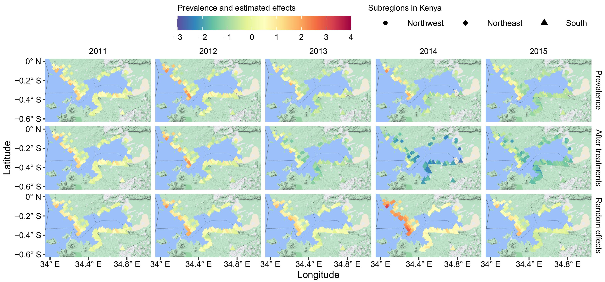
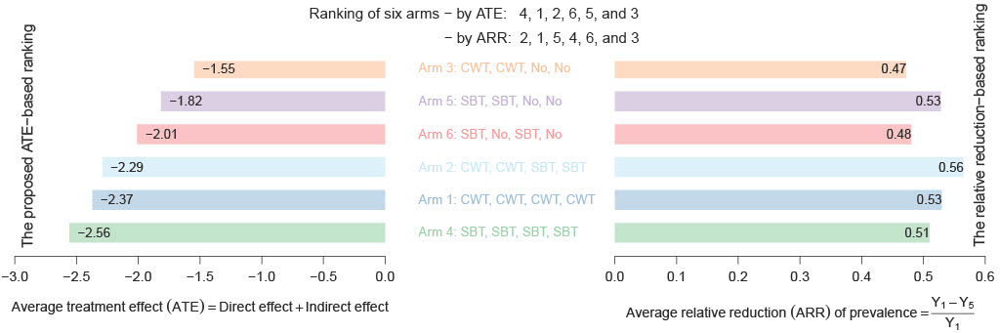
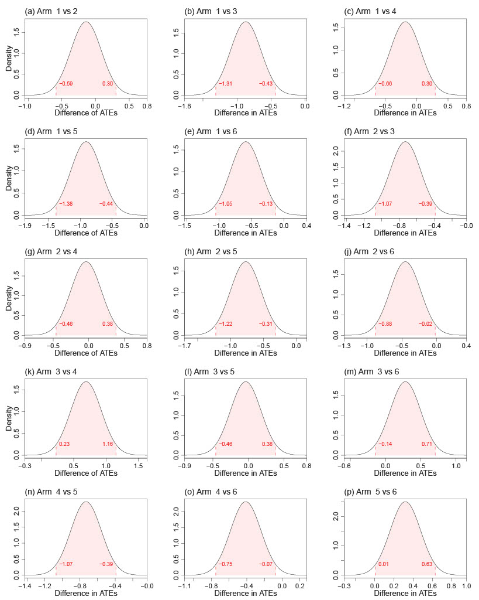

# Estimating Direct and Indirect Treatment Effects in Spacetime-Dependent CRTs

This Github page provides code and data for reproducing the results in the manuscript:``Estimating Direct and Indirect Treatment Effects and Ranking Treatment Regimens in Spacetime Dependent Cluster Randomized Trials: A Schistosomiasis Case Study'' by Y. Chen, X. Wen, F. Luo, Y. Yang, and Y. Shen. 

## Datasets of schistosomiasis from the SCORE project
Schistosomiasis, a neglected tropical parasitic disease, is prevalent in Africa, South America, and Asia − especially in rural areas with poor socioeconomic conditions (Hong et al., 2022) − with cases reported in more than 70 countries (World Health Organization, 2022).  In 2021 alone, at least 251 million people required preventive treatment (World Health Organization, 2023). Global efforts to control morbidity have primarily focused on preventive chemotherapy using praziquantel (PZQ), typically delivered through Mass Drug Administration (MDA) via School-Based Treatment (SBT) or Community-Wide Treatment (CWT). To systematically evaluate and compare the two treatment strategies, the Schistosomiasis Consortium for Operational Research and Evaluation (SCORE) conducted a five-year cluster randomized trial (CRT) across multiple countries. This data can be downloaded via [SCORE](https://clinepidb.org/ce/app/workspace/analyses/DS_d6a1141fbf/new). Data description is as follows:
- We analyze infection prevalence data for Schistosoma mansoni from 149 villages in Kenya and 149 villages in Tanzania, covering a wide age range from 5 to 77 years.
- These infection data, collected on a yearly scale, were obtained through the SCORE project over a 5-year period
- This project involves a CRT with six intervention arms
- Each arm received one of three treatment options (SBT, CWT, or no treatment) annually from the first to the fourth year

## Our methodology
Motivated by the need to identify optimal treatment regimens in the Schistosomiasis Consortium for Operational Research and Evaluation CRT, this study addresses two major methodological challenges in estimating treatment effects: (1) substantial bias arising from Indirect Effects (IEs) and time-varying Direct Effects (DEs) and (2) large variance due to unaccounted spatiotemporal dependencies. We identify optimal treatment regimens by evaluating differences through two components: DEs from the most recent treatment and IEs from historical treatment trajectories. To efficiently estimate DEs and IEs, we develop a Joint Spatiotemporal Varying Coefficient (JSTVC) model. JSTVC accounts for spatiotemporal dependencies and regional heterogeneities, while also capturing spatial anisotropic patterns associated with schistosomiasis transmission. 

## Scalable algorithms for large-scale randomized experiments with complex spatiotemporal dependence structure
To support scalable inference under complex dependent structures, we extend a hybrid computational method that integrates Variational Bayes with ensemble-based techniques, which can be available in the R file. The proposed methodology provides a broadly applicable framework for modeling complex dependencies in randomized experiments, especially in those involving multiple sequential interventions.

## Spatiotemporal patterns of schistosomiasis
Figure 1 illustrates the influence of treatment effects and spatiotemporal random effects on schistosomiasis, i.e.,
<figure id="Figure4">
  

  
    

  <figcaption>
  <strong>Figure 1:</strong> Spatiotemporal patterns of schistosomiasis prevalence (all results obtained under double logarithmic scale). Top panel: Observed prevalence. Middle panel: Prevalence excluding direct and indirect effects. Bottom panel: Recovered spatiotemporal random effects (including intercept term).
  </figcaption>
</figure>

## Ranking treatment regimens
Figure 2 shows ranking results of treatment regimens based on two methods: (1) the average relative reduction in prevalence from Year 1 to Year 5 across villages within each arm and (2) the ATE-based method from the proposed JSTVC. Our ranking results suggest that: (i) administering treatment every year generally outperforms strategies that miss treatments in some years and (ii) when treatment assignment interruptions are unavoidable, intermittent interruptions are more effective than consecutive interruptions.
<figure id="Figure4">
  

  
    

  <figcaption>
  <strong>Figure 2:</strong> Ranking treatment strategies for six arms in Tanzania. Left panel: Average Treatment Effect (ATE) calculated as the sum of Direct Effects (DEs) and Indirect Effects (IEs) from the proposed JSTVC. Right panel: Average relative reduction of observed outcomes from Year 1 to Year 5.
  </figcaption>
</figure>

## Differences in ATEs between different treatment regimens
Figure 3(c) shows that continuously applying CWT or SBT over four years (arms 1 and 4) does not produce a statistically significant difference, as the 95% CI of the difference includes zero. Significant differences are observed in the following scenarios: (i) when comparing a continuously applied treatment with an interrupted regimen in certain years - for example, arm 4 with Treatment = (SBT, SBT, SBT, SBT) shows significantly greater efficacy than arm 6 with Treatment = (SBT, No, SBT, No), with $DI_{4, 6}$ being significantly less than zero (Figure 3(o)); and (ii) when comparing consecutive interruptions of CWT or SBT with intermittent interruptions - for instance, arm 6 demonstrates significantly greater efficacy than arm 5 with Treatment = (SBT, SBT, No, No), with $DI_{5,6}$ significantly greater than zero (Figure 3(p)).
<figure id="Figure4">
  

  
    

  <figcaption>
  <strong>Figure 3:</strong> Posterior distributions of differences in Average Treatment Effects (ATEs) between arms are computed using the proposed JSTVC, with 95% credible intervals (CIs) highlighted by shaded areas.
  </figcaption>
</figure>

